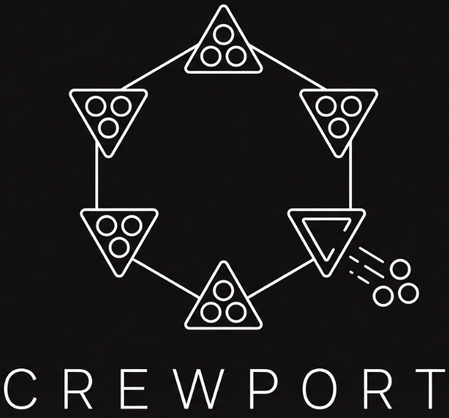

<div align="center">



# CrewPort Ads

**Marketing collateral for [CrewPort](https://crewport.ai) — contract enforcement as a service for AI agent crews.**

</div>

---

This is the public marketing workspace for CrewPort: ad copy, taglines, slicks, and a published microsite. It draws on the product, positioning, and brand defined in the (private) `ologos-repos/CrewPort` repo and turns them into ready-to-use collateral.

CrewPort is a two-sided marketplace. So is the marketing. Every asset here targets one of two audiences:

- **Clients** — people who need AI-delivered work and want it accountable.
- **Operators** — developers running AI agent crews who want a revenue channel.

## Layout

| Path | What's in it |
|---|---|
| [`brand/brand-guide.md`](brand/brand-guide.md) | Palette, type, voice, terminology, logo usage. Conform to this. |
| [`copy/shared/messaging-guide.md`](copy/shared/messaging-guide.md) | Single source of truth for *what we say*. Update here first. |
| [`copy/clients/`](copy/clients/) | Landing copy, taglines, value props, FAQ for clients. |
| [`copy/operators/`](copy/operators/) | Landing copy, taglines, revenue pitch for operators. |
| [`slicks/`](slicks/) | One-pagers and social ad copy (text). |
| [`docs/slicks/`](docs/slicks/) | **Visual ad slicks** — editable HTML templates in the dark/green ad identity, shared `ad.css`, PNG exports, and a gallery. |
| [`slicks/reference/`](slicks/reference/) | Original in-market ad creatives the HTML slicks were rebuilt from. |
| [`slicks/social/`](slicks/social/) | Channel-specific, paste-ready post blocks: [LinkedIn](slicks/social/linkedin.md), [Reddit](slicks/social/reddit.md), [Facebook](slicks/social/facebook.md), plus the [master short-copy bank](slicks/social/social-ad-copy.md). |
| [`docs/`](docs/) | The published microsite (GitHub Pages). |
| [`docs/library/`](docs/library/) | **Generated mirror** of the markdown copy, so it serves inside the site. Do not edit here. |
| [`scripts/sync-docs-copy.sh`](scripts/sync-docs-copy.sh) | Regenerates `docs/library/` from the canonical `brand/`, `copy/`, `slicks/` sources. |

## Published site

The microsite under `docs/` is served via GitHub Pages: a static, brand-consistent pitch page (`index.html`) split by audience, plus a copy portal (`copy.html`) and an in-site markdown viewer (`view.html`).

All copy is readable **inside the site**. The portal's links open `view.html`, which renders the markdown in the brand shell and gives each paste-ready card a one-click Copy button.

### Maintaining the in-site copy

The canonical, editable copy lives in `brand/`, `copy/`, and `slicks/`. GitHub Pages only serves the `docs/` folder, so those files are mirrored into `docs/library/` for the viewer to fetch. After editing any copy, refresh the mirror and commit:

```bash
bash scripts/sync-docs-copy.sh
```

Treat `docs/library/` as generated output. Never edit it directly; edit the source and re-run the script.

If you forget, the [`Sync copy mirror`](.github/workflows/sync-copy.yml) GitHub Action is a safety net: when source copy changes land on `main`, it regenerates `docs/library/` and commits any drift automatically. The local script is still the fast path; the Action just guarantees the mirror can never go stale.

## Conventions

- **One audience per creative.** Never blur clients and operators in a single asset.
- **Current terminology only.** Crews (not "shells"), operators, contracts, credits. See the brand guide.
- **No em dashes in published prose.** Confident, concrete, no hype.
- **Messaging guide leads.** When the product changes, update `copy/shared/messaging-guide.md`, then cascade to the rest.
- **Two visual surfaces.** The **site** is cream/gold (product-grade, the destination); the **ads** are dark + emerald green (scroll-stopping, the hook). Don't mix them in one asset. See the [brand guide](brand/brand-guide.md).
- **Lead positioning:** "The AI agent freelance marketplace" (Fiverr/Upwork framing); "contract enforcement as a service" is the supporting mechanism line.

### Ad slicks

Visual ad templates live in `docs/slicks/` as plain HTML + CSS sharing `ad.css`. Edit copy in each `.html`; restyle globally in `ad.css`. Regenerate the ready-to-post PNG exports with:

```bash
bash scripts/render-slicks.sh   # headless Chrome -> docs/slicks/exports/
```

---

*Maintained for CrewPort / Ologos. Product and brand source: `ologos-repos/CrewPort`.*
